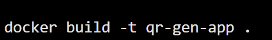
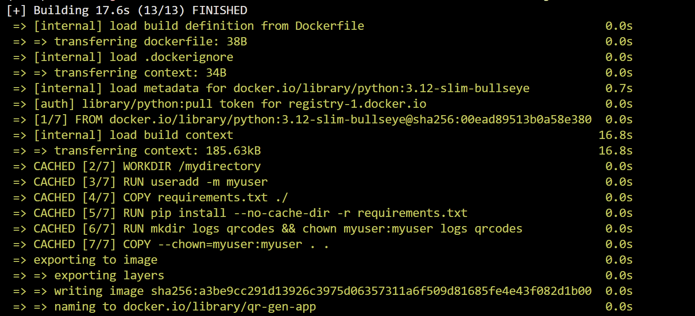
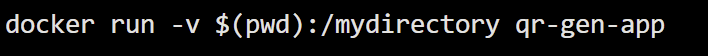
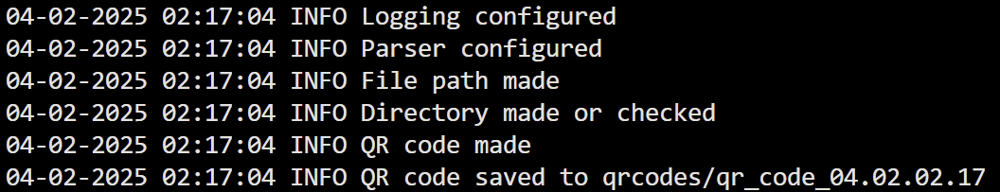

# Homework 7 QR Codes

# Project Install Requirements

virtualenv venv

Make sure to have docker installed!

source venv/bin/activate
docker build -t qr-gen-app
docker run -v $(pwd):/mydirectory qr-gen-app

# Screens

