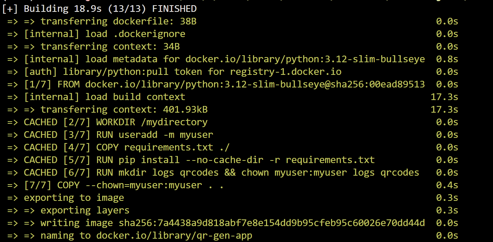

# Homework 7 QR Codes

# Project Install Requirements

virtualenv venv

Make sure to have docker installed!

source venv/bin/activate

docker build -t qr-gen-app

docker run -v $(pwd):/mydirectory qr-gen-app

# Screens

Note: Although I saved the qr codes to a separate folder, I included the specific one I made from this build here.
Also, had to alter the commands a bit because it was saying that my 

