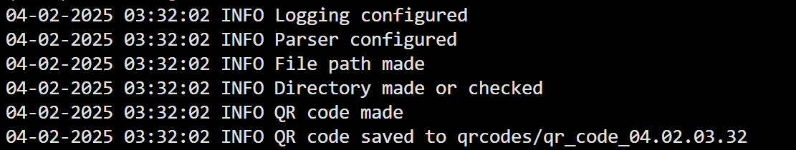

# Homework 7 QR Codes

# Project Install Requirements

virtualenv venv

Make sure to have docker installed!

source venv/bin/activate

docker build -t qr-gen-app .

docker run -v $(pwd):/mydirectory qr-gen-app

# Description
main.py - where I am running everything cohesively

configure - where all my configuring stuff is, so logging, configuring the parser, and making a file path and directory to wherever my environment variables say

generate_qr_code - actually generating the qr code and saving it

submission_images - just where I am storing the images below

# Screens

Note: Although I saved the qr codes to a separate folder, I included the specific one I made from this build here.
Also I modified my specific environment variables locally so the qr code would be magenta.

